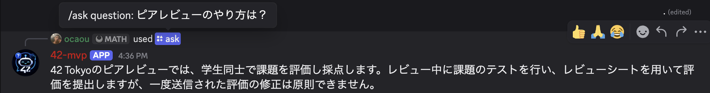
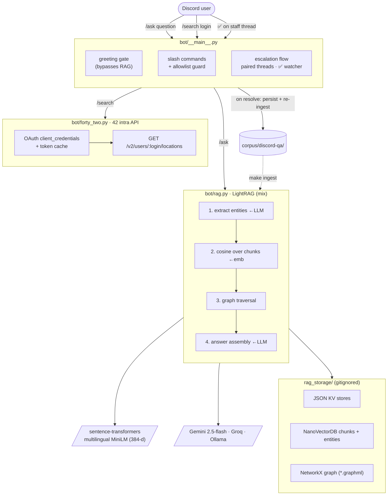
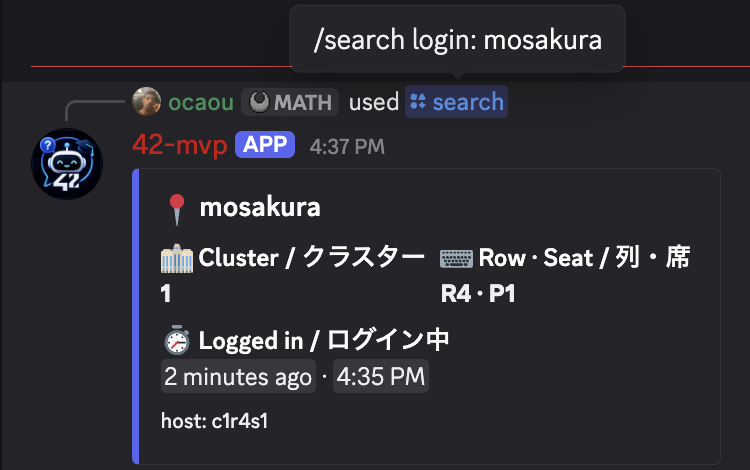
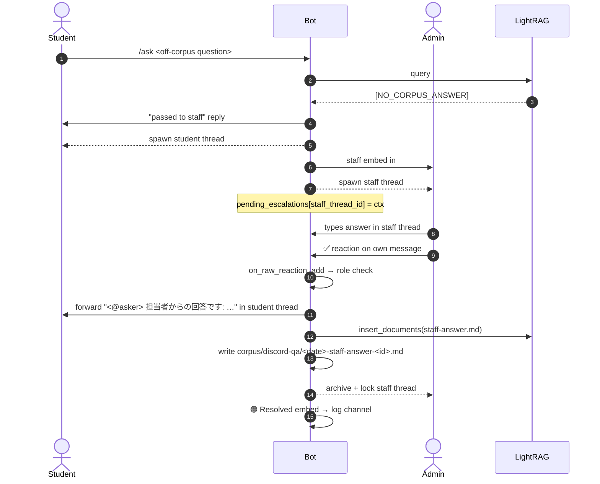
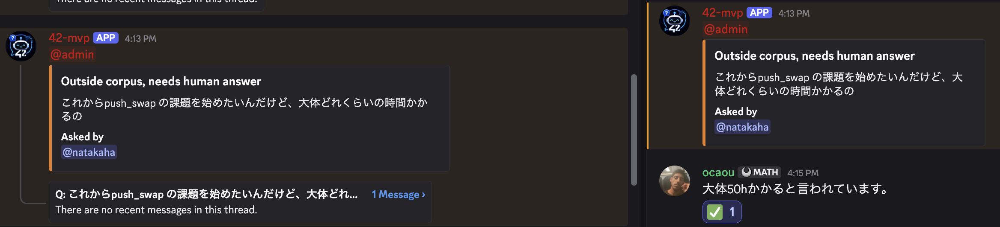
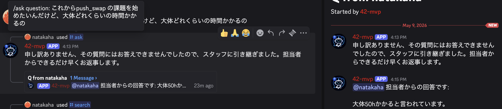

# 42Tokyo Discord QA Bot

A staff-support Discord bot for 42Tokyo. Students ask questions in Discord
with `/ask`; the bot answers from a knowledge graph of intra rules and
procedures. When it can't answer, it spawns paired threads, hands the
question to staff, and on a single ✅ from an admin it forwards the answer
back to the asker *and* ingests the Q+A into the corpus so the next ask
hits it. `/search login:<intra-name>` returns a bilingual card showing
where any 42 student is currently sitting.

Built around **LightRAG** (graph + vector retrieval) over the 42Tokyo
intra knowledge base — 60+ pages, mostly Japanese with some English —
plus the live 42 intra API for real-time location lookups.



## Features

- **`/ask <question>`** — Japanese or English. Replies in staff-DM voice
  (no markdown clutter, no citations) from the LightRAG graph.
- **`/search login:<intra-name>`** — bilingual EN/JA card showing the
  iMac the student is currently sitting at: cluster · floor · row · seat,
  with a live "logged in N minutes ago" timer.
- **Self-healing escalation** — `[NO_CORPUS_ANSWER]` spawns a thread on
  each side; the staff answer is forwarded to the asker, persisted to
  `corpus/discord-qa/`, and live-ingested into LightRAG so the same
  question answers from the corpus next time.
- **Greeting gate** — "hi" / "こんにちは" bypass RAG and get a friendly
  bilingual welcome with example queries.
- **Channel allowlist** — `ASK_CHANNEL_IDS` soft-restricts both commands
  to specific channels; Discord's per-command channel UI is the
  authoritative gate.
- **Activity log** — every greeting / answer / escalation / resolution /
  error mirrors to `BOT_LOG_CHANNEL_ID` as a color-coded embed.

## Architecture



The graph that ships in this repo (593 entities / 269 relations) was
built once via a one-off cached-response trick (see
[Ingest](#ingest)). For real production rebuilds, use **Groq Dev tier**.

## Project layout

```
discordBot/
├── bot/
│   ├── __init__.py
│   ├── __main__.py          # discord client, /ask, /search, escalation flow
│   ├── forty_two.py         # 42 intra API client (OAuth, locations endpoint)
│   ├── ingest.py            # CLI: walk corpus/ and ainsert into LightRAG
│   ├── llm.py               # deprecated stub (LightRAG handles generation now)
│   └── rag.py               # build_rag, query, citation extraction
├── corpus/
│   ├── README.md
│   ├── intra/               # 60 converted intra pages — base knowledge
│   └── discord-qa/          # historical staff Q&A + live escalation answers
├── cache/
│   ├── claude_chunks.jsonl    # 100 chunks dumped via LightRAG's chunker
│   └── claude_responses.json  # cached entity-extraction responses (replay source)
├── scripts/
│   ├── convert_qa.py        # HTML/PDF → markdown (trafilatura + bs4 + pdftotext)
│   ├── mine_discord_qa.py   # extract Q&A pairs from Discord export
│   ├── dump_chunks.py       # walk corpus → cache/claude_chunks.jsonl
│   ├── claude_ingest.py     # ingest using cached responses (no API calls)
│   ├── ingest_status.py     # snapshot for `make ingest-status`
│   └── retry_failed.py      # cleanup + retry for stuck docs (Ollama path)
├── docs/screenshots/        # README images
├── research/                # pre-build design notes (8 docs)
├── Q&A/                     # local-only raw HTML/PDF source (gitignored)
├── rag_storage/             # generated LightRAG state (gitignored)
├── .env.example
├── .gitignore
├── Makefile
├── README.md
└── requirements.txt
```

Local-only, not committed: `.env`, `Q&A/`, `rag_storage/`, `lightrag.log`,
`REVIEW.md`, `.venv/`.

## Quick start

### 1. Discord application

1. <https://discord.com/developers/applications> → **New Application**.
2. **Bot** tab → **Reset Token** → copy. On the same tab, scroll down and
   enable **Message Content Intent** (required so the bot can read the
   staff answer it ingests back into the corpus on ✅).
3. **OAuth2 → URL Generator**: scopes `bot` + `applications.commands`;
   permissions `View Channel`, `Send Messages`, `Embed Links`,
   `Read Message History`, `Add Reactions`, `Create Public Threads`,
   `Send Messages in Threads`, `Manage Threads`. Open the generated URL,
   invite the bot to a test server.

### 2. Configure

```sh
cp .env.example .env
```

Required: `DISCORD_TOKEN`. Strongly recommended: `DISCORD_GUILD_ID`
(your test server's id, with Developer Mode on; right-click the icon →
Copy Server ID) so slash commands sync instantly.

Optional:
- `GROQ_API_KEY` — fast ingest path (free tier limited; see below).
- `STAFF_CHANNEL_ID` — Discord channel that gets posted to on errors / escalations.
- `ADMIN_ROLE_ID` — role pinged on escalations and required to confirm staff
  answers via ✅ reaction (see [Staff escalation flow](#staff-escalation-flow)).
- `BOT_LOG_CHANNEL_ID` — channel where the bot mirrors all activity (boot,
  queries, escalations, resolutions, errors).
- `ASK_CHANNEL_IDS` — comma-separated channel IDs where `/ask` and `/search`
  are allowed. Soft fallback only; the authoritative way to hide a command
  is **Server Settings → Integrations → bot → /ask → Channels** (Discord UI).
- `FORTYTWO_UID` / `FORTYTWO_SECRET` — 42 API credentials for `/search`
  (see [Locating a student](#locating-a-student)).

### 3. Install Ollama + pull a model (optional, for local fallback)

```sh
brew install ollama
ollama serve &              # keep running in background
ollama pull qwen2.5:7b      # ~4.7 GB, used as the local fallback LLM
```

### 4. Build + run

```sh
make install                # creates .venv, installs deps
make convert                # only if you have raw HTML/PDF in Q&A/
make ingest-replay          # replay the checked-in graph (~14s, no API)
                            # OR  make ingest   (rebuild via Groq, ~30 min)
make run                    # start the Discord bot
```

In Discord:

```
/ask How does the Black Hole work?
/ask ピアレビューはどうやるの？
/ask hi
```

Replies are an embed with the answer + cited filenames + the query mode used.

## Locating a student

`/search login:emoulaya` returns a small bilingual (EN / JA) card with
the iMac the student is currently sitting at — cluster, floor (when the
host name encodes it), row · seat — and Discord's live relative timestamp
for how long they've been logged in. Powered by the
[42 intra API](https://api.intra.42.fr/apidoc/2.0/locations.html) over the
OAuth client-credentials flow.



Setup:

1. Register an OAuth app at <https://profile.intra.42.fr/oauth/applications>
   on any 42 student account. Scope `public` is enough; any localhost
   redirect URI satisfies the form (we use the client_credentials flow,
   which never redirects).
2. Copy the UID and SECRET into `.env` as `FORTYTWO_UID` and `FORTYTWO_SECRET`.
3. Restart the bot.

The hostname parser handles `c1r4p5` and `e1r4p5` style names (cluster, row,
seat). Floors are derived from the host prefix when it looks floor-ish
(`e1` → "1F"); otherwise the floor field is omitted. If the format isn't
recognized the embed shows the raw host instead of parsed coordinates.

Without `FORTYTWO_UID` / `FORTYTWO_SECRET` set, `/search` replies with a
friendly "not configured" ephemeral message — the rest of the bot still
works.

## Staff escalation flow

When LightRAG returns its `[NO_CORPUS_ANSWER]` sentinel, the bot spawns a
thread on each side and closes the loop on a single ✅ reaction:



The staff thread side:



The student side, post-resolution:



**Required for this flow**: `STAFF_CHANNEL_ID`, `ADMIN_ROLE_ID`, the
`Create Public Threads` / `Send Messages in Threads` / `Manage Threads`
bot permissions on both channels, and Message Content Intent in the
Developer Portal. The bot uses `on_raw_reaction_add` so cache-miss on
freshly created thread messages doesn't drop the ✅.

**Known limitation**: in-flight escalations are tracked in memory. A bot
restart between escalation and the ✅ drops the context — the reaction
becomes a no-op. Acceptable for the demo; production would persist
`pending_escalations` to a file.

## Make targets

| Target | What it does |
|---|---|
| `make install` | Create `.venv`, install all requirements |
| `make convert` | `Q&A/` (raw HTML/PDF) → `corpus/intra/` (markdown) via trafilatura |
| `make ingest` | Build the LightRAG graph using whichever LLM is in `.env` (Gemini → Groq → Ollama auto-detect). Slow first time. |
| `make ingest-replay` | Replay the checked-in `cache/claude_responses.json` to rebuild the exact shipped graph in ~14s, no API tokens spent. |
| `make ingest-status` | Show progress, ETA, recent log lines |
| `make ingest-tail` | `tail -f` the live ingest log |
| `make run` | Start the Discord bot |
| `make webui` | Launch LightRAG visualization UI on `:9621` |
| `make clean` | Remove generated state and pycache |

## Ingest

LightRAG's ingest extracts entities and relations from each chunk via an
LLM call. For 60 docs / 100 chunks that's ~100-200 LLM round-trips with
prompts of ~5-7K tokens each — which is the bottleneck.

Three paths to populate `rag_storage/`:

### `make ingest-replay` (default, no API)

The graph that ships in this repo (`cache/claude_responses.json`,
~163KB) was generated once by reading every chunk by hand and writing
the entity/relation tuples in LightRAG's expected delimited format
(`entity<|#|>name<|#|>type<|#|>desc` etc.), keyed by content hash. The
ingest script (`scripts/claude_ingest.py`) injects a fake `llm_model_func`
that looks up cached responses instead of calling any external API.

For this build I produced those responses by hand-running Claude over
the corpus inside a Claude Code session — pure time/token efficiency,
since I was already in the loop. **For a production rebuild on fresh
data, do NOT do this — use Groq.**

```sh
make ingest-replay  # ~14 seconds, deterministic
```

Result: 593 entities / 269 relations / 100 chunk vectors / 60 docs.

### `make ingest` with Groq Dev tier (recommended for fresh corpora)

The free-tier 6K TPM cap is below LightRAG's prompt size, so the free
tier will fail. The Dev tier (~$3 one-time top-up) lifts it.

```sh
# in .env:
GROQ_API_KEY=gsk_...
GROQ_MODEL=qwen/qwen3-32b
LLM_PROVIDER=groq
```

Then `make ingest` — ~30 min for the full corpus.

### `make ingest` with Ollama (local, slow, free)

Set `LLM_PROVIDER=ollama` in `.env`. Runs locally on `qwen2.5:7b` (or
similar). Plan on 5-7 hours unattended on an M-series Mac. Larger docs
may hit timeouts; `scripts/retry_failed.py` retries those with smaller
chunks.

## Query-time LLM

Queries are always single small calls (~1-2K tokens with retrieved
context), so any of Gemini free / Groq free / Ollama work. Order of
preference: Gemini 2.5-flash-lite (fast, free 15 RPM / 1000 RPD) →
Groq → Ollama. Auto-detected from `.env`.

## Inspecting the knowledge graph

After ingest, launch the LightRAG webui:

```sh
make webui
```

Then open <http://localhost:9621>. Tabs: knowledge graph (entities +
relations, draggable), documents, query, server logs.

Note: webui queries use Ollama bindings; the bot uses sentence-
transformers for embeddings, so search results in the webui won't match
the bot. **Use the webui for graph + chunk inspection, the bot for
actual answers.**

## Adding more documents

Two paths.

**If you have HTML pages saved from intra** (login required, so save them
manually in your logged-in browser):

1. Drop the saved `.html` files into `Q&A/` (gitignored).
2. `make convert` — produces clean markdown in `corpus/intra/`.
3. `make ingest` — LightRAG hashes content; unchanged docs are skipped.
4. Restart the bot.

**If you already have markdown** — just drop `.md` or `.txt` files
anywhere under `corpus/` (subdirs are walked) and `make ingest`.

## Troubleshooting

### Webui knowledge graph is empty

The lightrag-server loads the graph file once at startup and doesn't
auto-reload. After running `make ingest-replay` or `make ingest`,
restart the webui (`kill <pid> && make webui`) so it picks up the
populated graph.

The webui uses Ollama `all-minilm` for embeddings (384-d, matches our
storage) — not the same model as the bot uses. So similarity scores in
the webui's "Query" tab will be off-axis. Use the webui for inspection
only; use the Discord bot for real querying.

### Ingest leaves some docs in `failed` status (Ollama path)

Big multi-page docs sometimes hit `httpx.ReadTimeout` or LightRAG's
internal worker timeout when local `qwen2.5:7b` takes too long. Re-running
`make ingest` doesn't retry them — LightRAG creates `dup-*` ghost entries.
Use the surgical retry helper:

```sh
.venv/bin/python scripts/retry_failed.py
```

It cleans `dup-*` entries, flips `failed` → `pending`, and re-runs the
proper LightRAG retry pipeline with smaller chunks (600 tokens) and
bumped timeouts (900s).

### Query latency is high (60–200s)

That's local Ollama doing real work for every `/ask`. Discord lets
you wait up to 15 min on a deferred reply, so it works — but it's not
snappy. Add a `GEMINI_API_KEY` or `GROQ_API_KEY` to `.env` and queries
drop to ~3-5 seconds.

### Slash commands don't show up

Set `DISCORD_GUILD_ID` in `.env` to your test server's id and restart.
Without it, sync is global and takes up to an hour to propagate.

## Roadmap

Done:
- ✅ 42 API integration — `/search login` returns live iMac location.
- ✅ Self-healing escalation loop — staff answers ingest back into the corpus.

Still on the wishlist:
- `/me` dashboard — Black Hole countdown, current project, peer-review queue.
- Feedback loop: thumbs-up/down reactions feed a curated answer store.
- Eval set + retrieval metrics (precision@k, mode comparison).
- Hyperlinked citations back to the source intra page.
- Persist `pending_escalations` to disk so a bot restart doesn't drop in-flight escalations.
